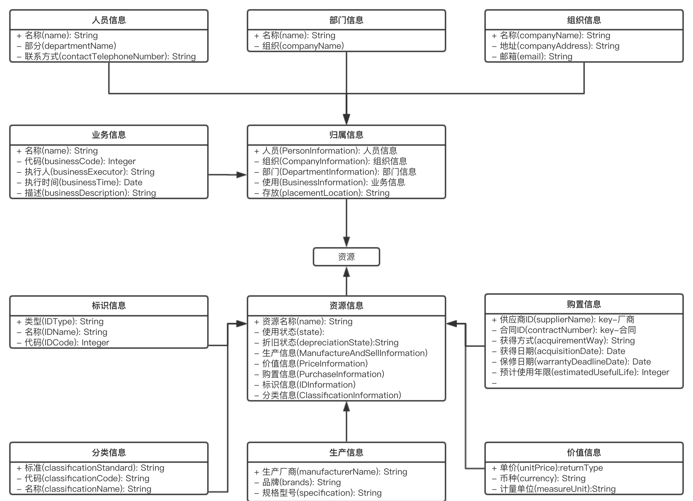

Functional requirements
=======================

Resource Manage System
----------------------

单品分析
~~~~~~~~~~~~~~

Manage Context
~~~~~~~~~~~~~~

- Cabinet
- ServerDevice
    + CPU
    + RAM
    + NIC
    + Disk
- NetworkDevice
    + 路由器
    + 交换机
- SecurityDevice
    + 防火墙
    + 入侵检测设备
    + 漏洞扫描设备
- StorageDevice
    + 磁盘阵
    + 网络存储设
    + 移动存储设
- TerminalEquipment
    + 扫描仪
    + 考勤机
- InAndOutDevice
- Domain
- Certificat
- IP

Component
~~~~~~~~~

- 合同
- 供应商

